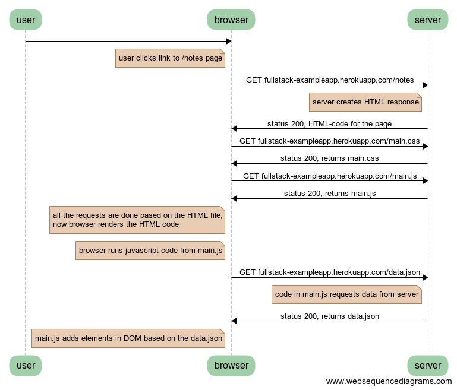

# osa0 tehtava 0.3

The task: [0.3](https://fullstackopen.github.io/teht%C3%A4v%C3%A4t/#03-muistiinpanojen-sivu)

## Link to source

Open in [WebSequenceDiagram editor](https://www.websequencediagrams.com/?lz=dXNlci0-YnJvd3NlcjoKbm90ZSBsZWZ0IG9mIAAPBwogIHVzZXIgY2xpY2tzIGxpbmsgdG8gL25vdGVzIHBhZ2UKZW5kIG5vdGUKCgBDBy0-c2VydmVyOiBHRVQgZnVsbHN0YWNrLWV4YW1wbGVhcHAuaGVyb2t1YXBwLmNvbQBHBgBxDgA8BgogAAIHIGNyZWF0ZXMgSFRNTCByZXNwb25zAHALAGsGAIFCCiBzdGF0dXMgMjAwLAAvBS1jb2RlIGZvciB0aGUAgTIGAHY5bWFpbi5jc3MAWB5yZXR1cm5zIAAlCQCCSRYAgncHIHJlLXJlbmRlcnMAgRkJIHdpdGggY3NzIACCIUMAgTAFagCBCCxqAIESIXVucyBqYXZhc2NyaXB0IACCXQZyb20ANwkAhBIJAIRFFmFsbACDCgVyZXF1ZXN0cyBhcmUgZG9uZSBiYXNlZCBvbgCDKQUAg28FZmlsZSwKIG5vdwCCKAsAgiYKAIQTBWNvZACES0RkYXRhLmpzb24AhHwXAIRGBWluAIIeCACBNQpkYXRhAIF7BgCFOAcAhHomAIQiCABhFwCHAQkAaAhhZGRzIGVsZW1lbnRzIGluIERPTQCCJA4AgTgKAIcVCA&s=roundgreen)

## Code
```
user->browser:
note left of browser
  user clicks link to /notes page
end note

browser->server: GET fullstack-exampleapp.herokuapp.com/notes
note left of server
  server creates HTML response
end note
server->browser: status 200, HTML-code for the page

browser->server: GET fullstack-exampleapp.herokuapp.com/main.css
server->browser: status 200, returns main.css
note left of browser
 browser re-renders the page with css
end note

browser->server: GET fullstack-exampleapp.herokuapp.com/main.js
server->browser: status 200, returns main.js
note left of browser
 browser runs javascript code from main.js
end note
note left of browser
 all the requests are done based on the HTML file,
 now browser renders the HTML code
end note

browser->server: GET fullstack-exampleapp.herokuapp.com/data.json
note left of server
  code in main.js requests data from server
end note
server->browser: status 200, returns data.json
note left of browser
 main.js adds elements in DOM based on the data.json
end note
```

## Chart

