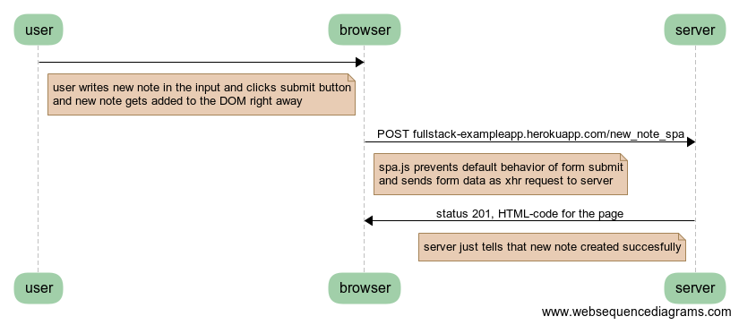

# osa0 tehtava 0.6

The task: [0.6](https://fullstackopen.github.io/teht%C3%A4v%C3%A4t/#06-uusi-muistiinpano-spassa)

## Link to source

Open in [WebSequenceDiagram editor](https://www.websequencediagrams.com/?lz=dXNlci0-YnJvd3NlcjoKbm90ZSBsZWZ0IG9mIAAPBwogIHVzZXIgd3JpdGVzIG5ldyAAIgVpbiB0aGUgaW5wdXQgYW5kIGNsaWNrcyBzdWJtaXQgYnV0dG9uCiAAFgUALAlnZXRzIGFkZGVkIHRvADsFRE9NIHJpZ2h0IGF3YXkKZW5kAFoFCgoAgQ4HLT5zZXJ2ZXI6IFBPU1QgZnVsbHN0YWNrLWV4YW1wbGVhcHAuaGVyb2t1YXBwLmNvbS9uZXdfbm90ZV9zcGEAgUwGAFoGAIFGDXNwYS5qcyBwcmV2ZW50cyBkZWZhdWx0IGJlaGF2aW9yIG9mIGZvcm0AgUcIAIFCB3NlbmRzABMGZGF0YSBhcyB4aHIgcmVxdWVzdCB0byAAgSgGAIE-CgCBOAYAgloKIHN0YXR1cyAyMDEsIEhUTUwtY29kZSBmb3IAgkoFcGFnZQCCeQ4ASgcgAFMHIGp1c3QgdGVsbHMgdGhhdACDBwpjcmVhdGVkIHN1Y2Nlc2Z1bGwAgkQL&s=roundgreen)

## Code
```
user->browser:
note left of browser
  user writes new note in the input and clicks submit button
  and new note gets added to the DOM right away
end note

browser->server: POST fullstack-exampleapp.herokuapp.com/new_note_spa
note right of browser
  spa.js prevents default behavior of form submit
  and sends form data as xhr request to server
end note
server->browser: status 201, HTML-code for the page
note left of server
  server just tells that new note created succesfully
end note
```

## Chart

